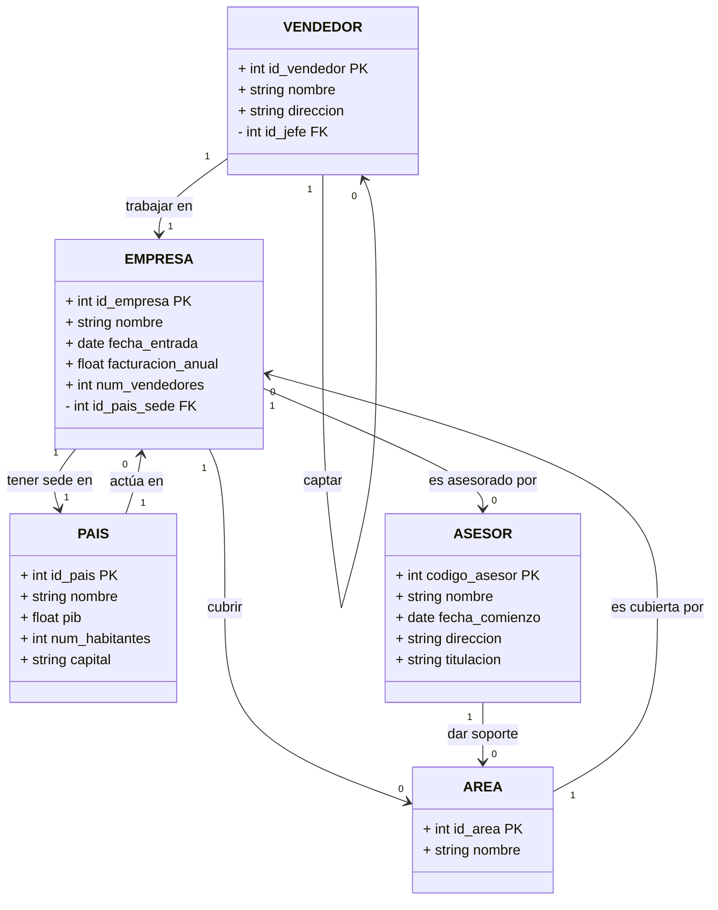

```mermaid

classDiagram

    class VENDEDOR {
        + int id_vendedor PK
        + string nombre
        + string direccion
        - int id_jefe FK
    }


    class EMPRESA {
        + int id_empresa PK
        + string nombre
        + date fecha_entrada
        + float facturacion_anual
        + int num_vendedores
        - int id_pais_sede FK
    }


    class PAIS {
        + int id_pais PK
        + string nombre
        + float pib
        + int num_habitantes
        + string capital
    }


    class AREA {
        + int id_area PK
        + string nombre
    }


    class ASESOR {
        + int codigo_asesor PK
        + string nombre
        + date fecha_comienzo
        + string direccion
        + string titulacion
    }


    
    VENDEDOR "1" --> "0" VENDEDOR : captar
    VENDEDOR "1" --> "1" EMPRESA : trabajar en
    EMPRESA "1" --> "1" PAIS : tener sede en
    EMPRESA "1" --> "0" AREA : cubrir
    EMPRESA "1" --> "0" ASESOR : es asesorado por
    ASESOR "1" --> "0" AREA : dar soporte
    AREA "1" --> "0" EMPRESA : es cubierta por
    PAIS "1" --> "0" EMPRESA : actúa en


```

