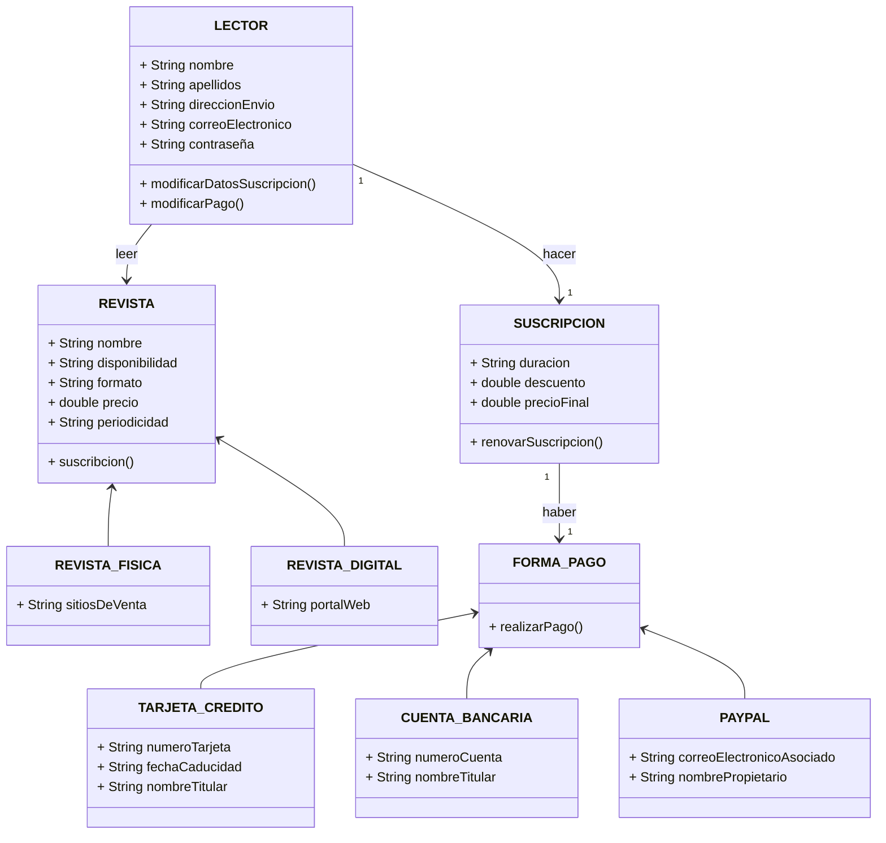

```mermaid

classDiagram

    class REVISTA {
        + String nombre
        + String disponibilidad
        + String formato
        + double precio
        + String periodicidad
        + suscribcion()
    }


    class REVISTA_FISICA {
        + String sitiosDeVenta
    }


    class REVISTA_DIGITAL {
        + String portalWeb
    }


    class SUSCRIPCION {
        + String duracion
        + double descuento
        + double precioFinal
        + renovarSuscripcion()
    }


    class LECTOR {
        + String nombre
        + String apellidos
        + String direccionEnvio
        + String correoElectronico
        + String contraseña
        + modificarDatosSuscripcion()
        + modificarPago()
    }


    class FORMA_PAGO {
        + realizarPago()
    }


    class TARJETA_CREDITO {
        + String numeroTarjeta
        + String fechaCaducidad
        + String nombreTitular
    }


    class CUENTA_BANCARIA {
        + String numeroCuenta
        + String nombreTitular
    }


    class PAYPAL {
        + String correoElectronicoAsociado
        + String nombrePropietario
    }


    LECTOR --> REVISTA: leer
    REVISTA <-- REVISTA_FISICA
    REVISTA <-- REVISTA_DIGITAL
    LECTOR "1" --> "1" SUSCRIPCION: hacer
    SUSCRIPCION "1" --> "1" FORMA_PAGO: haber
    FORMA_PAGO <-- TARJETA_CREDITO
    FORMA_PAGO <-- CUENTA_BANCARIA
    FORMA_PAGO <-- PAYPAL


```
