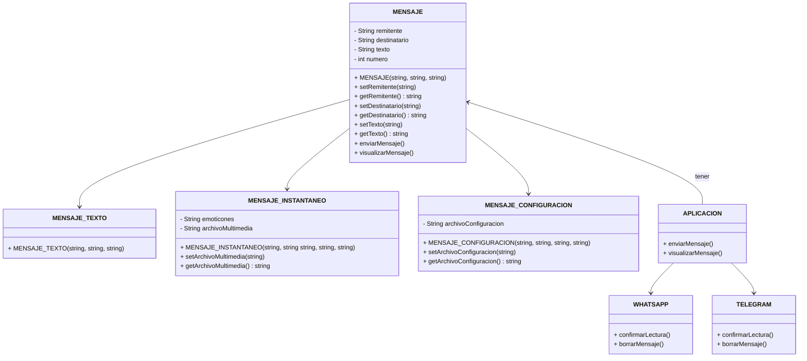

```mermaid

classDiagram

    class MENSAJE {
        - String remitente
        - String destinatario
        - String texto
        - int numero
        + MENSAJE(string, string, string)
        + setRemitente(string)
        + getRemitente() string
        + setDestinatario(string)
        + getDestinatario() string
        + setTexto(string)
        + getTexto() string
        + enviarMensaje()
        + visualizarMensaje()
    }


    class MENSAJE_TEXTO {
        + MENSAJE_TEXTO(string, string, string)
    }


    class MENSAJE_INSTANTANEO {
        - String emoticones
        - String archivoMultimedia
        + MENSAJE_INSTANTANEO(string, string string, string, string)
        + setArchivoMultimedia(string)
        + getArchivoMultimedia() string
    }


    class MENSAJE_CONFIGURACION {
        - String archivoConfiguracion
        + MENSAJE_CONFIGURACION(string, string, string, string)
        + setArchivoConfiguracion(string)
        + getArchivoConfiguracion() string
    }


    class APLICACION {
        + enviarMensaje()
        + visualizarMensaje()
    }

    
    class WHATSAPP {
        + confirmarLectura()
        + borrarMensaje()
    }

    
    class TELEGRAM {
        + confirmarLectura()
        + borrarMensaje()
    }

    
    MENSAJE --> MENSAJE_TEXTO
    MENSAJE --> MENSAJE_INSTANTANEO
    MENSAJE --> MENSAJE_CONFIGURACION
    APLICACION --> WHATSAPP
    APLICACION --> TELEGRAM
    MENSAJE <-- APLICACION: tener

```
