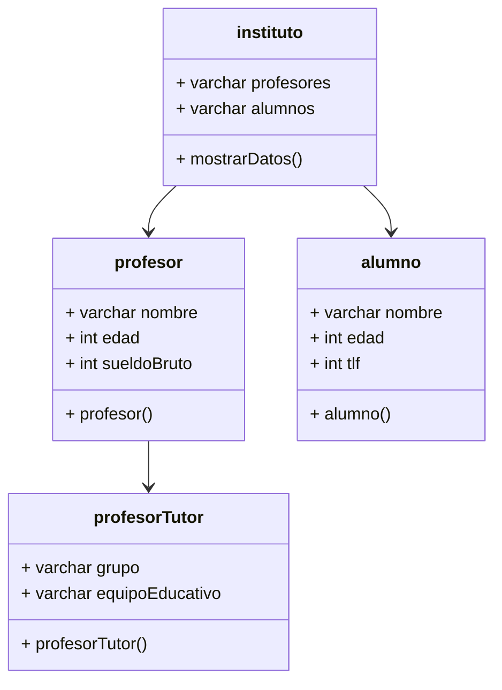

```mermaid
classDiagram

class instituto {
    + varchar profesores
    + varchar alumnos
    + mostrarDatos()
}

class profesor {
    + varchar nombre
    + int edad
    + int sueldoBruto
    + profesor()
}

class alumno {
    + varchar nombre
    + int edad
    + int tlf
    + alumno()
}

class profesorTutor {
    + varchar grupo
    + varchar equipoEducativo
    + profesorTutor()
}

instituto--> profesor
instituto--> alumno
profesor--> profesorTutor

```
