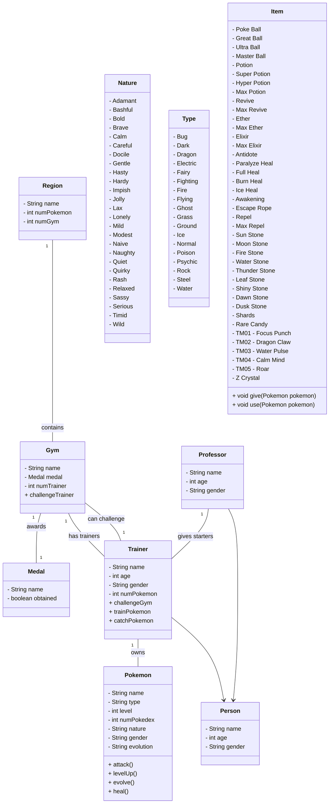

```mermaid
classDiagram

    class Region {
        - String name
        - int numPokemon
        - int numGym
    }


    class Gym {
        - String name
        - Medal medal
        - int numTrainer
        + challengeTrainer
    }


    class Pokemon {
        - String name
        - String type
        - int level
        - int numPokedex
        - String nature
        - String gender
        - String evolution
        + attack()
        + levelUp()
        + evolve()
        + heal()
    }


    class Trainer {
        - String name
        - int age
        - String gender
        - int numPokemon
        + challengeGym
        + trainPokemon
        + catchPokemon
    }

    
    class Professor {
        - String name
        - int age
        - String gender
    }


    class Person {
        - String name
        - int age
        - String gender
    }


    class Nature {
        - Adamant
        - Bashful
        - Bold
        - Brave
        - Calm
        - Careful
        - Docile
        - Gentle
        - Hasty
        - Hardy
        - Impish
        - Jolly
        - Lax
        - Lonely
        - Mild
        - Modest
        - Naive
        - Naughty
        - Quiet
        - Quirky
        - Rash
        - Relaxed
        - Sassy
        - Serious
        - Timid
        - Wild
    }


    class Type {
        - Bug
        - Dark
        - Dragon
        - Electric
        - Fairy
        - Fighting
        - Fire
        - Flying
        - Ghost
        - Grass
        - Ground
        - Ice
        - Normal
        - Poison
        - Psychic
        - Rock
        - Steel
        - Water
    }


    class Item {
        - Poke Ball
        - Great Ball
        - Ultra Ball
        - Master Ball
        - Potion
        - Super Potion
        - Hyper Potion
        - Max Potion
        - Revive
        - Max Revive
        - Ether
        - Max Ether
        - Elixir
        - Max Elixir
        - Antidote
        - Paralyze Heal
        - Full Heal
        - Burn Heal
        - Ice Heal
        - Awakening
        - Escape Rope
        - Repel
        - Max Repel
        - Sun Stone
        - Moon Stone
        - Fire Stone
        - Water Stone
        - Thunder Stone
        - Leaf Stone
        - Shiny Stone
        - Dawn Stone
        - Dusk Stone
        - Shards
        - Rare Candy
        - TM01 - Focus Punch
        - TM02 - Dragon Claw
        - TM03 - Water Pulse
        - TM04 - Calm Mind
        - TM05 - Roar
        - Z Crystal
        + void give(Pokemon pokemon)
        + void use(Pokemon pokemon)
    }


    class Medal {
        - String name
        - boolean obtained
    }


    
    
    Region "1" -- "" Gym : contains
    Gym "1" -- "1" Medal : awards
    Gym "1" -- "" Trainer : has trainers
    Trainer "1" -- "" Pokemon : owns
    Trainer "1" -- "" Gym : can challenge
    Professor "1" -- "" Trainer : gives starters
    Trainer --> Person
    Professor --> Person


```

